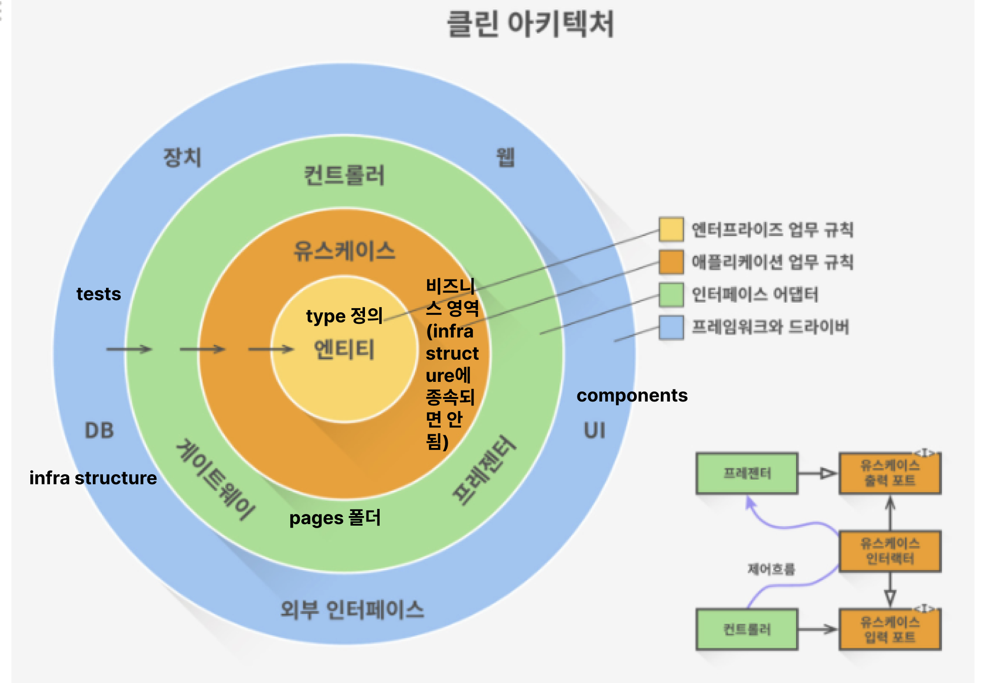

# 클린 아키텍처를 활용한 채팅앱

## 목표

1. 관심사의 분리: 각 레이어와 컴포넌트가 담당하는 역할과 책임을 명확히 하여, 재사용과 유지 보수를 용이하게 한다.

2. 테스트 용이성: 각 레이어와 컴포넌트가 독립적으로 테스트 가능하도록 설계하여, 안정적인 애플리케이션을 구축한다.

3. 확장성: 시스템을 모듈화하여 필요에 따라 쉽게 기능을 추가하거나 수정할 수 있도록 한다.

4. 성능 최적화: 사용자 경험을 개선하기 위해 애플리케이션의 성능을 최적화한다.

5. 보안: 사용자 데이터와 시스템 보안을 최우선으로 고려하여, 각 레이어에서 적절한 보안 메커니즘을 구현한다.

6. 코드 품질: 코드 리뷰와 정적 분석 도구를 활용하여 지속적으로 코드 품질을 관리하고 개선한다.

### 전략

1. 아키텍처 설계: 클린 아키텍처 원칙에 따라 엔터티, 유스 케이스, 인터페이스, 인프라스트럭처 레이어를 명확히 구분한다.
   레이어간의 의존성은 안쪽에서 바깥쪽으로 향하도록 한다.

2. 컴포넌트 구조: 컴포넌트는 가능한 작은 단위로 분리하여 재사용성을 높이고, 유지 보수를 쉽게 한다.
   상태 관리는 효과적인 방법으로 처리하여 애플리케이션의 복잡성을 관리한다.

3. 테스트: 단위 테스트, 통합 테스트, E2E 테스트를 적절히 구성하여 애플리케이션의 안정성을 보장한다.
   테스트 자동화를 통해 지속적인 품질 관리를 수행한다.

4. 성능: 렌더링 최적화와 코드 분할을 적용하여 애플리케이션의 로딩 시간과 반응성을 개선한다.
   성능 모니터링 도구를 활용하여 실시간으로 성능을 모니터링하고 최적화 작업을 수행한다.

5. 보안: 보안 최적화 및 보안 패턴을 적용하여 사용자 데이터와 시스템을 보호한다.
   보안 취약성을 지속적으로 모니터링하고, 필요에 따라 즉시 대응한다.
